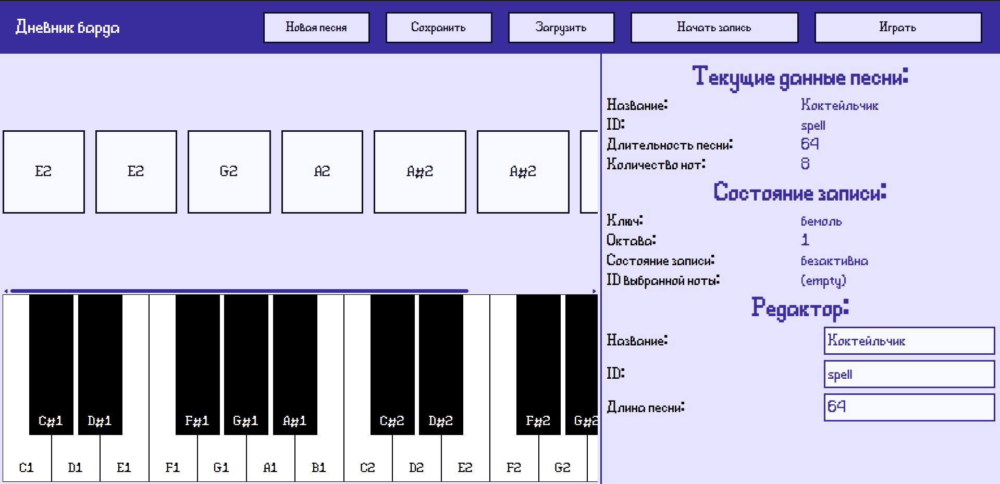

# Дневник барда

Редактор заклинаний барда для игры `Heroes of Envell`

## Как установить?

1. Скачать [*редактор*](https://github.com/Rul991/bard-spell-editor/releases/latest).
2. Скачать и установить [*локальный сервер*](https://github.com/Rul991/envell-tools-local-server).
3. В *папке с локальным сервером* есть папка `sites/`, в нее распаковать *скачанный архив*.
4. Запустить *локальный сервер*.
5. Открыть *браузер*, ввести: [`127.0.0.1:3000`](localhost:3000).
6. Выбрать *`bard`*.
7. ...
8. **ПРОФИТ!!!**

## Горячие клавиши:

- `Shift+Колесико мыши` - скроллинг списка добавленных нот.

### Ноты:

- `ПКМ/Двойное нажатие` - удаление ноты.
- `ЛКМ` - выбор ноты для редактирования.

### Во время записи:

- `Q, W, E, R, T, Y, U`(переключатель, не требует удержания кнопки) - добавление *ноты* в промежутке ( `C`(до) - `B`(си) )
- `H, J, K, L`(переключатели) - переключение *октавы* от 1 до 4.
- `B, N`(переключатели) - переключение *октавы* от 5(мажорные аккорды) до 6(минорные аккорды).
- `Ctrl`(переключатель) - переключение *ключа* ( `бемоль` / `диез` ).
- `Shift`(требует удержание кнопки) - добавление *ключа* ноте.

## Ссылки:

- *Репозиторий движка игры*: [*Клик*](https://github.com/traeterno/Ae2D) 
